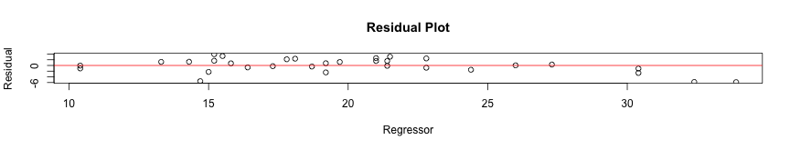
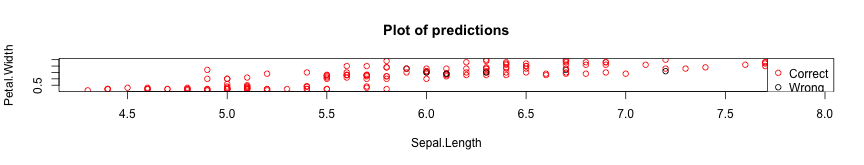
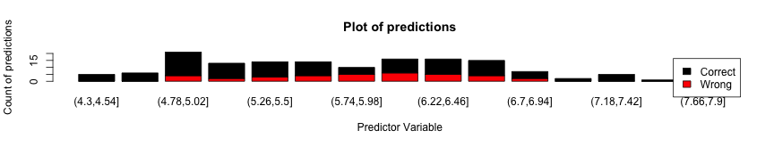

Modelfitter
========================================================
author: Benjamin Mohn
date: 29th January 2019
autosize: true
font-import: https://fonts.googleapis.com/css?family=Courgette
font-family: 'Courgette'


A app to fit any model you want


Inputs
========================================================
The app is divided into two tabs. One holding the documentation, called **Description**. The other is for the output of the calculation and is called **Application**.
In this presentation I am more focusing on the later tab. Since the description tab is meant as a manual.
The user is ask to do 5 inputs. They all are shown below, in brackets it is stated what kind of input it is. 

1. Select a data set 1 out of 7 (drop down)  
2. Select one or two x variable used as predictors (check box)
3. Select one y variable to predict (radio button)
4. Select a model 1 out of 5 (radio botton)
5. Start calculation (button)


    
Specials
========================================================
### data set selection:

Possibiltioes for features and regressor are updated

### x vars selected:   

Selected featues are excluded from regressor choices and text on top is updated.

### y var selected: 

Depending on choice the model selection is updated
Distinguishing Classification and Regression.

### model selected: 

The model selected does not have a impact on the selections. 

Outputs
========================================================
Output for **mtcars**, x = **hp** & **wt**, y = **mpg**, **lm**


```
  intercept     RMSE  Rsquared      MAE    RMSESD RsquaredSD    MAESD
1      TRUE 2.699095 0.8428444 2.108253 0.5585966 0.06193087 0.424544
```


```

Call:
lm(formula = .outcome ~ ., data = dat)

Coefficients:
(Intercept)           hp           wt  
   37.22727     -0.03177     -3.87783  
```

Plots
========================================================




