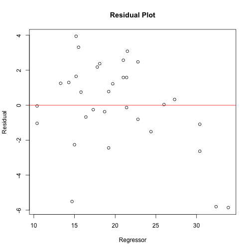

Modelfitter
========================================================
author: Benjamin Mohn
date: 29th January 2019
autosize: true
font-import: https://fonts.googleapis.com/css?family=Courgette
font-family: 'Courgette'


A app to fit any model you want


Inputs
========================================================

This Slides shortly describes all the input fields:

All in all there are 5 inputs a user can make

1. Select a data set (drop down)  
    - select one of the following data sets  
        - mtcars  
        - faithful  
        - chickWeight  
        - insectSpray   
        - iris  
        - toothGrowth  
        - orange  
2. Select at one or two x variable used as predictors (check box)
3. Select one y variable to predict (radio button)
4. Select a model (radio botton)
    - wether the selected variable is a factor or not will have influence on the models to be choosen
5. Start calculation (button)
    - this is Button which is visible only if at least one x variable is chosen 

Specials
========================================================

While the user is selecting the input the possibilities will change on this slide I am going to explain what is changing. 

### data set selection:

When the user is seletecting a data set the choices for the x and y variables get updated to the names of the columns. 
For the y variables the first one is selcted per default. The x variables do not have a default selection. 

### x vars selected:   

Here several things happen. 
First of all as long as no variable is selected the calculate button is hidden. Once the first vairable is selected, the button will be shown. 
Secondly each variable that is selcted here gets excluded from the possible y variable, since it does not make sense to predict a variable that is used as feature. 
Thirdly the text above the check boxes change, such that the user knows how many features he can still select. Once the user selected two features all other names are hidden and only the two selected are shown. 

### y var selected: 

As the user is selecting the variable the user want to predict it is possible that the models change. 
The set of models differ between factor column and regression columns. 

### model selected: 

The model selected does not have a impact on the selections. 

Outputs
========================================================

The following two slides are focussing on the output of the app. On this slide the output will be described and on the next one there will be examples given. 

### General
The output is generated vie the *caret* package. Each model is calculated using this package and the accordingly selected model. The model itself is build with the entire dataset, there is not Test-Train Split performed. Therefore the accuracy numbers are taken from the fit on the training set. 
The output consists of three parts.

### Results
At the begining the results are printed. This is simple the output one gets when calling *$result* on a fitted model. Here you see couple or error metrics on how the model performed.  

### Model Info
Secondly information about the model are printed. This is generated via *$finalModel*. Depending on the selected model this can look different.


### Plot
The third about generated is plot. Here three cases need to be destinguished and in each of the cases the plot will look slightly different. 

**Regression** - In the case a residual plot is shown. 

**Classification** - This case needs to be further destinguished: 

1. **one feature** - In this case the x-axis is the features variable divided into groups. On the y-axis the counts are shown. Where *correct* and *wrong* predictions are stacked.
2. **two features** - Here the two features variables are the x and y axis. The color of the dots indicate wethere the prediction for it with *correct* or *wrong*.

Examples
========================================================
Outputs shown for: **mtcars**, x = **hp** & **wt**, y = **mpg**, **ridge**


```r
require(caret)
model_fit <- train(mtcars[c("hp", "wt")], mtcars$mpg, method = "ridge")
```


```r
### First output
model_fit$results
```

```
  lambda     RMSE  Rsquared      MAE    RMSESD RsquaredSD     MAESD
1  0e+00 2.817044 0.8473608 2.214867 0.5960391 0.05362692 0.5016931
2  1e-04 2.817053 0.8473623 2.214858 0.5960345 0.05362714 0.5016950
3  1e-01 2.836182 0.8478436 2.221051 0.6067962 0.05393499 0.5180563
```


```r
### Second output
model_fit$finalModel
```

```

Call:
elasticnet::enet(x = as.matrix(x), y = y, lambda = param$lambda)
Cp statistics of the Lasso fit 
Cp: 137.422  73.564   3.000 
DF: 1 2 3 
Sequence of  moves:
     wt hp  
Var   2  1 3
Step  1  2 3
```


```r
### Third output
difference <- (predict.train(model_fit) - mtcars$mpg)
plot(
     x=mtcars$mpg, y=difference, main = "Residual Plot",
     xlab = "Regressor", ylab = "Residual"
     )
abline(h=0, col="red")
```


